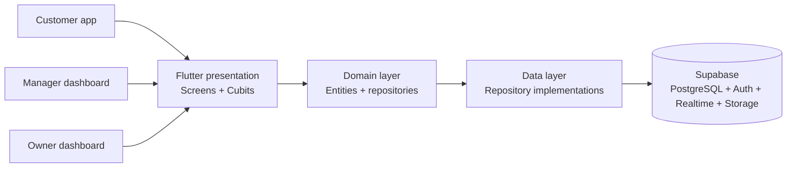

# SPICY — Multi-Branch Restaurant Commerce Platform

[](https://flutter.dev)
[](https://dart.dev)
[](https://supabase.com)
[](#technology-stack)

SPICY is a multilingual restaurant ordering and operations platform built for a
restaurant group with three branches in Maykop, Russia. It combines the
customer ordering journey, branch-level order operations, and centralized
owner administration in one Flutter codebase.

This repository contains a production-minded prototype designed around real
business requirements: branch-specific menus and availability, cash orders,
scheduled pickup, real-time order status updates, reusable menu modifiers,
reviews, and role-based dashboards.

## Business problem

Managing several restaurant locations creates more complexity than a standard
single-menu ordering app. Prices and availability can differ by branch,
managers should only control their assigned location, and the owner needs a
single place to manage the entire business.

SPICY addresses this with three purpose-built experiences:

| Role | Main capabilities |
| --- | --- |
| Customer | Select a branch, browse its available menu, customize items, place cash orders, track status, repeat previous orders, and leave reviews |
| Branch manager | Receive live branch orders, move orders through their workflow, inspect order details, and control item/category availability for one branch |
| Owner | View business activity, manage every branch, assign managers, edit menu content and prices, upload images, configure modifiers, and review customer feedback |

## Key features

- Three-branch restaurant model with branch-specific pricing and availability
- Customer-selected branch for ordering and pickup
- Immediate or scheduled pickup times
- Cash-on-receipt checkout with required customer contact information
- Product variants, quantities, and configurable paid or free modifiers
- Modifier groups assignable to one item or an entire category
- Branch-level item and category availability controls
- Real-time order updates for customers and restaurant staff
- Daily order numbering scoped to each branch
- Customer order history, order repetition, cancellation rules, and reviews
- Owner and manager dashboards protected by role-based access
- Image upload support through Supabase Storage
- Responsive layouts for mobile and web
- Russian, English, and Arabic localization, including RTL support

## Architecture

The application follows a feature-first, layered architecture. Business rules
are separated from Flutter widgets and from Supabase-specific implementation
details, making the system easier to test, maintain, and extend.



Each feature owns its presentation, domain, and data concerns where applicable:

```text
lib/
├── core/                  # Configuration, routing, localization, theme, widgets
├── features/
│   ├── auth/              # Registration, login, sessions, role routing
│   ├── branch/            # Branch selection and branch data
│   ├── cart/              # Cart and checkout
│   ├── manager/           # Branch operations dashboard
│   ├── menu/              # Menu, variants, modifiers, availability
│   ├── order_tracking/    # Ordering, history, and live status
│   ├── owner/             # Centralized administration
│   ├── profile/           # Customer profile and contact information
│   └── reviews/           # Customer and management review workflows
└── main.dart              # Dependency composition and application entry point
```

## Technology stack

| Area | Technology |
| --- | --- |
| Client applications | Flutter and Dart |
| State management | BLoC/Cubit and Provider |
| Navigation | GoRouter with role-aware redirects |
| Backend platform | Supabase |
| Database | PostgreSQL with versioned SQL migrations |
| Authentication | Supabase Auth with email confirmation |
| Authorization | PostgreSQL Row Level Security and role-based policies |
| Live updates | Supabase Realtime |
| File storage | Supabase Storage |
| Maps foundation | Flutter Map and geographic coordinates |
| Supported targets | Web, iOS, and Android |
| Testing | Flutter Test and static analysis |

## Backend and security

The backend is managed as code. Database schema changes are stored in
[`supabase/migrations`](supabase/migrations), with separate seed and diagnostic
query directories.

Important security decisions include:

- Row Level Security restricts customer, manager, and owner data access
- Managers are scoped to their assigned branch
- Sensitive order operations are implemented through validated database
  functions
- Client totals and item selections are validated against database data
- Only the public Supabase client configuration is used by Flutter
- Supabase service-role credentials are never stored in the client or repository

See [`supabase/README.md`](supabase/README.md) for the database deployment
workflow.

## Local development

### Prerequisites

- Flutter SDK compatible with Dart `^3.12.2`
- A Supabase project with the repository migrations applied
- Chrome, an Android emulator/device, or an iOS simulator/device

### Install dependencies

```bash
flutter pub get
```

### Run the application

Pass the public Supabase configuration at build time:

```bash
flutter run -d chrome \
  --dart-define=SUPABASE_URL=https://your-project.supabase.co \
  --dart-define=SUPABASE_PUBLISHABLE_KEY=your-publishable-key
```

Never place a Supabase service-role key in Flutter, GitHub, or a public hosting
environment. It is a privileged server-only credential.

## Quality checks

```bash
flutter analyze
flutter test
```

The test suite covers application startup, localization behavior, responsive
widget constraints, and menu filtering rules such as sandwich subcategories.

## Engineering highlights

- Translated business requirements into a multi-role product architecture
- Designed a normalized PostgreSQL schema and incremental migration strategy
- Implemented clean boundaries between UI, domain rules, and backend services
- Modeled branch-level operational controls without duplicating the core menu
- Built real-time order workflows for both customer and staff experiences
- Designed multilingual, responsive interfaces for mobile and desktop web
- Applied least-privilege authorization with Supabase Auth and PostgreSQL RLS

## Project role

**Full-Stack Flutter Developer & Solution Architect**

Responsibilities included business analysis, product design, solution
architecture, Flutter frontend development, Supabase/PostgreSQL backend design,
authentication and authorization, responsive UI implementation, localization,
testing, and deployment preparation.

## Current status

The core prototype is functional. Future production work includes online
payments, production SMS authentication, push notifications, operational
monitoring, automated deployment pipelines, and store-release hardening.
